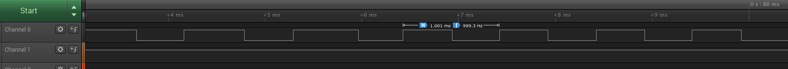

### GPIO-12 board

This is a gpio over usb board based on VUSB stack for AVR atmega8 chip. It exposes 12 GPIO ports.

### how to flash mega8
`cd firmware`  
`make hex`  
`avrdude -c usbasp -p m8 -U flash:w:main.hex`  

### How to compile and load driver
`cd driver/gpio`  
`make`  
`sudo insmod usb-gpio12.ko`  

### PIN mapping

Atmega8 gpio | pin number
-------------| ------------
PD0          |   1
PD1          |   2
PD2          | Not available (used as D+)
PD3          | 3
PD4          | Not available (used as D-)
PD5          | 4
PD6          | 5
PD7          | 6
PB0          | 7
PB1          | 8
PB2          | 9
PB3          | 10
PB4          | 11
PB5          | 12
PB6          | Not available (used by crystal)
PB7          | not available (used by crystal)

### how to access gpio port
`$ cd /sys/class/gpio/ `  
           `gpiochip**N**` where **N** is the value allocated by kernel   
`$ sudo chmod 666 export unexport`  
`$ echo **N** > export`  
To Allocate next gpio (depending upon gpio_chip.ngpio value),  
`$ echo **N+1 > export`
 a folder named gpioN must be created  
`$ cd gpio**N**`  
`$ cat value`  
`$ echo 1 > value`  
`$ echo 0 > value`  

Before unloading the module, do $ echo **N** > unexport  
gpio**N** gets deleted by doing so.  
To unload the module, `$ sudo rmmod usb_gpio`  

### How to control gpio pins via libusb
In case, you want to control gpio ports via libusb, follow this guide.

include following code in your application code or include the common.h file.


```C
typedef enum _command
{
   BOARD_INIT,  // This does the init of board
   BOARD_RESET, // This restarts the board
   GPIO_INPUT,  // Set GPIO as input
   GPIO_OUTPUT, // Set GPIO as output
   GPIO_READ,   // Read GPIO
   GPIO_WRITE,  // Write to GPIO
};

typedef struct __attribute__((__packed__)) _gpio_info
{
   uint8_t no;
   uint8_t val;
} gpio_info;

typedef struct __attribute__((__packed__)) _pktheader
{
   uint8_t command;
   gpio_info gpio;
} pktheader;
```

- init the board
```C
uint8_t buffer[3];
usb_control_msg(handle, USB_TYPE_VENDOR | USB_RECIP_DEVICE | USB_ENDPOINT_IN,
                        BOARD_INIT, 0, 0, buffer, 3, 1000);
pktheader *reply = (pktheader *)buffer;
```
- set GPIO as output
```C
uint8_t buffer[3];
usb_control_msg(handle, USB_TYPE_VENDOR | USB_RECIP_DEVICE | USB_ENDPOINT_IN,
                        GPIO_OUTPUT, gpio_number, 0, buffer, 3, 1000);
pktheader *reply = (pktheader *)buffer;
```

- write to GPIO

*high*  
```C
uint8_t buffer[3];
usb_control_msg(handle, USB_TYPE_VENDOR | USB_RECIP_DEVICE | USB_ENDPOINT_IN,
                        GPIO_WRITE, gpio_number | (1 << 8), 0, buffer, 3, 1000);
pktheader *reply = (pktheader *)buffer;
```

*low*  
```C
uint8_t buffer[3];
usb_control_msg(handle, USB_TYPE_VENDOR | USB_RECIP_DEVICE | USB_ENDPOINT_IN,
                        GPIO_WRITE, gpio_number | (0 << 8), 0, buffer, 3, 1000);
pktheader *reply = (pktheader *)buffer;
```

- Read GPIO
```C
uint8_t buffer[3];

usb_control_msg(handle, USB_TYPE_VENDOR | USB_RECIP_DEVICE | USB_ENDPOINT_IN,
                        GPIO_INPUT, gpio_number, 0, buffer, 3, 1000);
usb_control_msg(handle, USB_TYPE_VENDOR | USB_RECIP_DEVICE | USB_ENDPOINT_IN,
                        GPIO_READ, gpio_number, 0, buffer, 3, 1000);
pktheader *reply = (pktheader *)buffer;

uint8_t gpio_read_val = reply->val;
```

- Reset Board
```C
uint8_t buffer[3];
usb_control_msg(handle, USB_TYPE_VENDOR | USB_RECIP_DEVICE | USB_ENDPOINT_IN,
                        BOARD_RESET, 0, 0, buffer, 3, 1000);
pktheader *reply = (pktheader *)buffer;
```

you can look into [ubstest](https://raw.githubusercontent.com/amitesh-singh/usb-gpio-board/master/firmware/usbtest/usbtest.c) example for more details.

### GPIO write speed

In my testing with logic analyzer, its close to 1Khz.

### TODOs
 - ~~write firmware~~
 - ~~write basic gpio driver~~
 - ~~Add support of spin locking in gpio driver.~~
 - Add support of spi bitbang driver.
 - ~~Add support of spi hw in firmware.~~ board gets reset everytime on spi. not possible
 - ~~Add support of spi hw driver.~~ not required.
 - Add support of i2c in firmware.
 - Add support of i2c driver.
 - Add adc support in firmware.
 - Add adc driver support.
 - design schematic.


## Links
 - how to make nice pinouts: http://www.pighixxx.com/test/?s=made+a+pinout
 http://www.pighixxx.com/test/2016/06/how-its-made-a-pinout-part-1/
