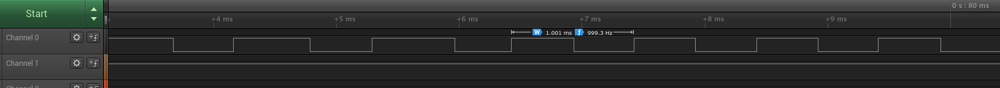

### GPIO-12 board

This is a gpio over usb board based on [VUSB](https://www.obdev.at/products/vusb/index.html) stack for AVR atmega8 chip. It exposes 12 GPIO ports.

My current prototype uses [USBPrayog Board](http://rarecomponents.com/store/1411?search=prayog) from
[rarecomponents.com](http://rarecomponents.com).

I shall produce an exclusive kicad schematic for this board soon.
[](https://www.youtube.com/watch?v=E6ALEKi3zcU)


### How to flash mega8
`cd firmware`  
`make hex`  
`avrdude -c usbasp -p m8 -U flash:w:main.hex`  


### PIN mapping
#### GPIO pins
Atmega8 gpio | pin number
-------------| ------------
PD0          |   1
PD1          |   2
PD2          |   Not available (used as D+)
PD3          |   3
PD4          |   Not available (used as D-)
PD5          |   4
PD6          |   5
PD7          |   6
PB0          |   7
PB1          |   8
PB2          |   9
PB3          |   10
PB4          |   11
PB5          |   12
PB6          |   Not available (used by crystal)
PB7          |   Not available (used by crystal)

#### ADC pins
Atmega8 ADC pin | pin number
--------------- | ------------
PC0             |   0
PC1             |   1
PC2             |   2
PC3             |   3
PC4             |   4
PC5             |   5

### how to access gpio port as linux kernel sysfs
You need to load the kernel driver for this.

`$ cd driver/gpio`  
`$ make`  
`$ sudo insmod usb-gpio12.ko`  
`$ cd /sys/class/gpio/ `  
           `gpiochip**N**` where **N** is the value allocated by kernel   
`$ sudo chmod 666 export unexport`  
`$ echo **N** > export`  
`$ cd gpio**N**`  
`$ echo out > direction`  
`$ cat value`  
`$ echo 1 > value`  
`$ echo 0 > value`  

Before unloading the module, do $ echo **N** > unexport  
gpio**N** gets deleted by doing so.  
To unload the module, `$ sudo rmmod usb_gpio12`  

### How to control gpio pins via libusb
In case, you want to control gpio ports via libusb, follow this guide.

include following code in your application code or include the common.h file.


```C
typedef struct __attribute__((__packed__)) _gpio_info
{
   uint8_t no;
   uint8_t data;
} gpio_info;

typedef struct __attribute__((__packed__)) _gpiopktheader
{
   uint8_t command;
   gpio_info gpio;
} gpiopktheader;

typedef struct __attribute__((__packed__)) _spipktheader
{
   uint8_t command;
   uint8_t data;
   uint8_t speed; //future;
} spipktheader;

typedef struct __attribute__((__packed__)) _adcpktheader
{
   uint8_t command;
   uint8_t gpio_no; //C0 -- C5
   uint16_t data; //ADC data is 12 bits (0 - 1024)
   uint8_t speed; //Future
} adcpktheader;

typedef enum _command
{
   BOARD_INIT, // This does the init of board
   BOARD_RESET, // This restarts the board
   GPIO_INPUT, // Set GPIO as input
   GPIO_OUTPUT, // Set GPIO as output
   GPIO_READ,   // Read GPIO
   GPIO_WRITE, // Write to GPIO
   SPI_INIT,  // Initialize SPI
   SPI_DATA,  // Send data over SPI
   SPI_END,  // End spi connection
   ADC_INIT, // Initialize ADC
   ADC_READ, // Read ADC value from ADC pin (C0 - C5)
   ADC_END,  // End ADC
} command;

```

- init the board
```C
uint8_t buffer[3];
usb_control_msg(handle, USB_TYPE_VENDOR | USB_RECIP_DEVICE | USB_ENDPOINT_IN,
                        BOARD_INIT, 0, 0, buffer, 3, 1000);
gpiopktheader *reply = (gpiopktheader *)buffer;
```
- set GPIO as output
```C
uint8_t buffer[3];
usb_control_msg(handle, USB_TYPE_VENDOR | USB_RECIP_DEVICE | USB_ENDPOINT_IN,
                        GPIO_OUTPUT, gpio_number, 0, buffer, 3, 1000);
gpiopktheader *reply = (gpiopktheader *)buffer;
```

- write to GPIO

*high*  
```C
uint8_t buffer[3];
usb_control_msg(handle, USB_TYPE_VENDOR | USB_RECIP_DEVICE | USB_ENDPOINT_IN,
                        GPIO_WRITE, gpio_number | (1 << 8), 0, buffer, 3, 1000);
gpiopktheader *reply = (gpiopktheader *)buffer;
```

*low*  
```C
uint8_t buffer[3];
usb_control_msg(handle, USB_TYPE_VENDOR | USB_RECIP_DEVICE | USB_ENDPOINT_IN,
                        GPIO_WRITE, gpio_number | (0 << 8), 0, buffer, 3, 1000);
gpiopktheader *reply = (gpiopktheader *)buffer;
```

- Read GPIO
```C
uint8_t buffer[3];

usb_control_msg(handle, USB_TYPE_VENDOR | USB_RECIP_DEVICE | USB_ENDPOINT_IN,
                        GPIO_INPUT, gpio_number, 0, buffer, 3, 1000);
usb_control_msg(handle, USB_TYPE_VENDOR | USB_RECIP_DEVICE | USB_ENDPOINT_IN,
                        GPIO_READ, gpio_number, 0, buffer, 3, 1000);
gpiopktheader *reply = (gpiopktheader *)buffer;

uint8_t gpio_read_val = reply->val;
```

- Reset Board
```C
uint8_t buffer[3];
usb_control_msg(handle, USB_TYPE_VENDOR | USB_RECIP_DEVICE | USB_ENDPOINT_IN,
                        BOARD_RESET, 0, 0, buffer, 3, 1000);
gpiopktheader *reply = (gpiopktheader *)buffer;
```

- SPI communication

```C
uint8_t spi_data = 111;

nBytes = usb_control_msg(handle, USB_TYPE_VENDOR | USB_RECIP_DEVICE | USB_ENDPOINT_IN,
                                 SPI_INIT, 0, 0, 0, 0, 5000);

nBytes = usb_control_msg(handle, USB_TYPE_VENDOR | USB_RECIP_DEVICE | USB_ENDPOINT_IN,
                         SPI_DATA, 0 | (spi_data << 8), 0,
                         buffer, 3, 5000);
spipktheader *spi_info = (spipktheader *) buffer;
printf("MOSI data: %d", spi_info->data);

nBytes = usb_control_msg(handle, USB_TYPE_VENDOR | USB_RECIP_DEVICE | USB_ENDPOINT_IN,
                         SPI_END, 0, 0,
                         0, 0, 5000);
```

- ADC

```C

nBytes = usb_control_msg(handle, USB_TYPE_VENDOR | USB_RECIP_DEVICE | USB_ENDPOINT_IN,
                                 ADC_INIT, 0, 0,
                                 buffer, 1, 1000);

nBytes = usb_control_msg(handle, USB_TYPE_VENDOR | USB_RECIP_DEVICE | USB_ENDPOINT_IN,
                        ADC_READ, gpio_number, 0,
                        buffer, 5, 1000);

adcpktheader *adc_info = (adcpktheader *)buffer;
printf("ADC pin %d read value: %d\n", adc_info->gpio_no, adc_info->data);

nBytes = usb_control_msg(handle, USB_TYPE_VENDOR | USB_RECIP_DEVICE | USB_ENDPOINT_IN,
                         ADC_END, 0, 0,
                         buffer, 1, 1000);
```

you can look into [ubstest](https://raw.githubusercontent.com/amitesh-singh/usb-gpio-board/master/firmware/usbtest/usbtest.c) example for more details.
#### example
- [on-off](https://raw.githubusercontent.com/amitesh-singh/usb-gpio-board/master/examples/on-off/on-off.c)  

### GPIO write speed

GPIO write speed is close to 1Khz.

### TODOs
 - ~~write firmware~~ **DONE**
 - ~~write basic gpio driver~~ **DONE**
 - ~~Add support of spin locking in gpio driver.~~ **DONE**
 - Add support of spi bitbang driver.
 - ~~Add support of spi hw in firmware.~~ **DONE**
 - Add support of spi hw driver.
 - Add support of i2c in firmware.
 - Add support of i2c driver.
 - ~~Add adc support in firmware.~~  **DONE**
 - Add adc driver support.
 - design schematic.


## Links
 - how to make nice pinouts: http://www.pighixxx.com/test/?s=made+a+pinout
 http://www.pighixxx.com/test/2016/06/how-its-made-a-pinout-part-1/
- VUSB: https://www.obdev.at/products/vusb/index.html
